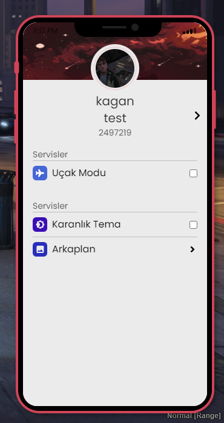

# nPhone

I wanted to share the phone I made for my own server, there are not many features for now, but I will add new applications and features with updates. You can specify the features & applications you want to be added.

- React
- Tailwind
- Responsive Design

# Applications

- Contacts
- Messages
- Camera
- Settings
- Twitter
- Yellow Pages
- Bank
- Map
- Gallery
- Job Center
- Busniess

If you have any error you can contact me with my discord: https://discord.gg/YGey2cgjEj

# Dependencies

- [qb-core](https://github.com/qbcore-framework/qb-core)
- [qb-management](https://github.com/qbcore-framework/qb-management)
- [oxmysql](https://github.com/overextended/oxmysql)

# Screenshots

()
()

# Credit

- For jobcenter lua part (https://github.com/Renewed-Scripts/qb-phone)
